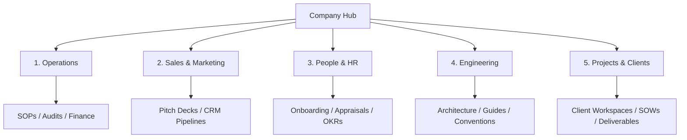

# Kiaan Technology — Company Docs Hub Guidelines

Internal operational protocol for structuring, naming, securing, and backing up company documentation in Notion & Git repositories.

---

## 🗺️ Notion Directory Hierarchy Map

Every document must be created inside one of these six parent containers. **No top-level pages outside this structure are allowed.**

---

## 🔐 Access Permissions Matrix

Access control levels must be assigned to every page according to its classification level:

| Classification | Scope | Access Controls | Example Document Types |
| :--- | :--- | :--- | :--- |
| **Public** | Anyone with link | Anonymous view-only access | External API guides, brand resources, hiring portals. |
| **Role-Based** | Departmental teams | Edit: Department Lead. View: Department Members. | Tech blueprints, CRM playbooks, training decks. |
| **Private** | C-Suite / Executives | Access restricted to designated email invites. | Board reports, salary sheets, financial statements. |
| **Client** | Shared Client Workspace | Edit: Kiaan PM. View: Client Stakeholders. | Weekly outcomes reports, SOWs, milestone reviews. |

---

## ✏️ Naming Conventions

All documents, assets, and markdown files must follow the strict date-and-version structure to prevent overrides and archive confusion:

`[YYYY-MM-DD]_[Document_Name]_v[Version]`

### Rules:
1. **Date format:** Always use leading zeros for months/days (e.g. `2026-07-30`).
2. **Dividers:** Use underscores (`_`) or hyphens (`-`) for spaces. Do not use blank spaces.
3. **Versioning:** End with a version tag (`_v1`, `_v1.2`, `_v2`).

### Examples:
- **Good:** `2026-07-30_Software_Development_SOP_v1.0.md`
- **Good:** `2026-08-18_SignFlow_Joint_Webinar_v1.2`
- **Bad:** `SOP dev new version.docx` (Missing date, spaces used, non-standard version tag)

---

## 🚫 No Orphan Pages Protocol

An "Orphan Page" is any document that lacks a parent index page or internal links pointing to it. To prevent index loss:

1. **Sub-page Creation:** When creating a new document, it must be created as a sub-page of an existing category index.
2. **Breadcrumb Links:** Every sub-page must contain a breadcrumb path at the very top (e.g., `Company > Operations > SOPs`).
3. **Database Indexing:** All loose project files must be registered as records in the master **Projects Index Database**.

---

## 💾 Weekly Google Drive Backup SOP

To safeguard intellectual property, backups must be performed weekly:

### Step-by-Step Backup:
1. **Schedule:** Every Friday at 17:00 IST.
2. **Export Format:** Go to Notion Settings ➔ Export Content ➔ Export all workspace data as Markdown & CSV files.
3. **Storage Vault:** Upload the exported ZIP archive to the secure Google Drive backup path:
   `Google Drive/Kiaan Backups/Notion/[YYYY-MM-DD]_Kiaan_Notion_Backup.zip`
4. **Retention Policy:** Retain the last 8 weekly backups; delete older archives to optimize space.
