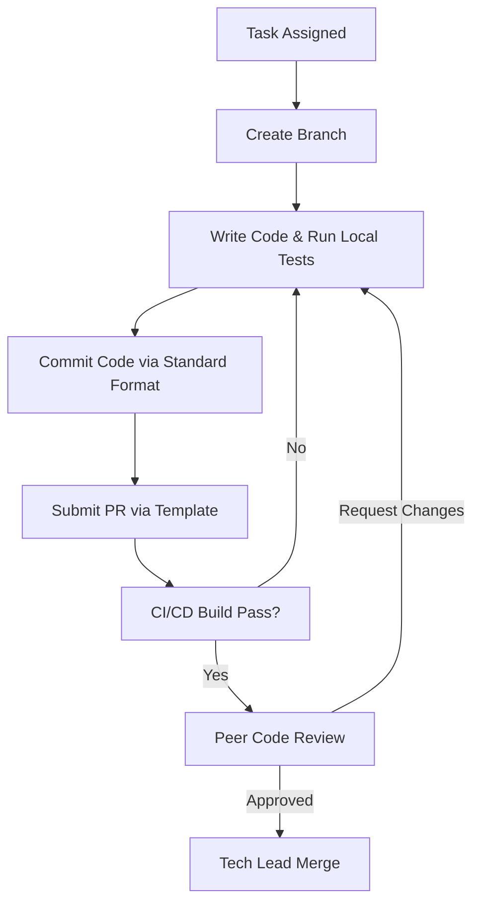
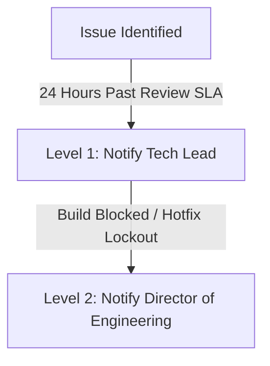

# Standard Operating Procedure (SOP): Software Development Lifecycle (SDLC)
**Document ID:** SOP-DEV-001  
**Scope:** Engineering Department, Frontend/Backend Developers, Team Leads, and DevOps.  
**Review Cycle:** Quarterly  
**Last Reviewed:** July 30, 2026

---

## 1. Purpose & Objectives
The purpose of this SOP is to define the standard engineering workflow at Kiaan Technology. This document ensures code consistency, reduces build failures, speeds up PR reviews, and maintains strict quality control over our code repositories through automated and manual practices.

---

## 2. Key Roles & Responsibilities
- **Developer (Dev):** Writes code, creates feature branches, self-tests code, submits Pull Requests (PRs), and addresses code review comments.
- **Peer Reviewer (Reviewer):** Conducts thorough reviews of submitted code, ensures architectural alignment, and approves/requests changes.
- **Tech Lead / Repo Maintainer:** Resolves architectural conflicts, oversees merges to release branches, and acts as Level 2 escalation.
- **DevOps Engineer:** Configures CI/CD pipelines, handles release packaging, and monitors build status logs.

---

## 3. Step-by-Step Workflow



### Step 3.1: Branch Naming Conventions
Developers must create a feature branch off the active development branch (usually `main` or `dev`) before coding. All branches must follow this structure:

`[type]/[issue-id]-[short-description]`

**Valid Types:**
- `feature/` - New feature implementation (e.g., `feature/JIRA-408-social-proof-bar`)
- `bugfix/` - Fix for existing bugs (e.g., `bugfix/PR-145-will-change-memory-leak`)
- `hotfix/` - Immediate critical production patches (e.g., `hotfix/LCP-images-optimization`)
- `refactor/` - Code style optimizations or refactoring without functionality change (e.g., `refactor/globals-css-cleanup`)
- `docs/` - Documentation updates (e.g., `docs/clutch-outreach-playbook`)

---

### Step 3.2: Commit Message Format
Kiaan Technology follows the **Conventional Commits** specification. Commit messages must be structured as follows:

`<type>(<scope>): <short description>`

**Types:**
- `feat`: A new feature (e.g., `feat(ui): add Calendly scheduling widget to demo page`)
- `fix`: A bug fix (e.g., `fix(reveal): release will-change to auto after animation finishes`)
- `refactor`: Code change that neither fixes a bug nor adds a feature (e.g., `refactor(layout): simplify global grid styles`)
- `perf`: Code change that improves performance (e.g., `perf(images): increase minimumCacheTTL to 31 days`)
- `docs`: Documentation changes only
- `style`: Changes that do not affect the meaning of the code (formatting, missing semi-colons, etc.)

---

### Step 3.3: Submit Pull Request (PR)
When code is ready, open a PR to `dev`. The PR description must strictly use the standard template below:

```markdown
## Description
<!-- Provide a clear summary of what this change does and why it was made -->

## Related Issues / Tickets
<!-- Link the corresponding PR number or JIRA issue. Example: Resolves #142 -->

## Changes Implemented
- [ ] Added/Modified feature details
- [ ] Local tests verified
- [ ] Mobile responsive checks completed

## Core Web Vitals Impact
- **LCP:** [Improved / No Impact / Warning]
- **INP:** [Improved / No Impact / Warning]
- **CLS:** [Improved / No Impact / Warning]

## Screenshots / Screen Recordings
<!-- Attach evidence of functional visual updates on screen -->
```

---

### Step 3.4: Code Review Rules
Every PR requires at least **one approved review** from a Peer Reviewer or Tech Lead before merging.
- **Self-Review:** Developer must review their own diff before requesting reviewers.
- **Automated Check:** CI/CD checks (linting, TypeScript types, and webpack build) must pass successfully.
- **Reviewer Checklist:**
  - Verify accessibility standards (semantic HTML, image alt tags).
  - Check for resource leaks (no blanket `will-change` on static layout components).
  - Verify responsiveness across mobile (390px) to desktop (1440px).
  - Ensure zero console errors, debug logs, or trailing comments.

---

## 4. Tools Used
- **Version Control:** Git & GitHub Enterprise
- **Project Tracking:** JIRA / GitHub Issues
- **Code Linting:** ESLint & Prettier
- **Build Engine:** Next.js Compiler & Webpack

---

## 5. Service Level Agreement (SLA)
- **Feature/Task Delivery:** Within estimated Sprint timeline (usually 2-week cycle).
- **PR Initial Review:** Within **24 hours** of submission.
- **Bugfix PR Review:** Within **4 hours** of submission.
- **Critical Hotfix PR Review:** Within **30 minutes** (immediate review).

---

## 6. Escalation Matrix



- **Level 1 (SLA Breach):** If a PR has been open and untouched for >24 hours, contact the **Tech Lead** (L1 Escalation).
- **Level 2 (Deployment Blocker):** If a hotfix build fails or dev branch gets locked, notify the **Director of Engineering** immediately.

---

## 7. Document Revision History

| Version | Date | Author | Description of Changes | Approved By |
| :--- | :--- | :--- | :--- | :--- |
| v1.0.0 | July 30, 2026 | Engineering Lead | Initial SDLC SOP with Conventional Commit & PR structures | VP of Engineering |
| | | | | |
