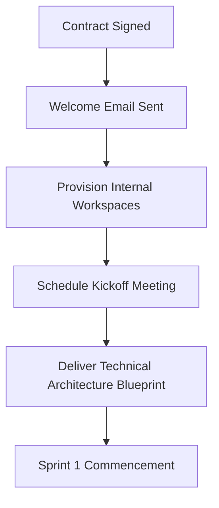

# Standard Operating Procedure (SOP): Client Onboarding
**Document ID:** SOP-ONBOARD-001  
**Scope:** Account Management, Project Management, and Engineering Team Leads.  
**Review Cycle:** Quarterly  
**Last Reviewed:** July 30, 2026

---

## 1. Purpose & Objectives
The purpose of this SOP is to outline the onboarding workflow for new clients at Kiaan Technology. A structured onboarding process ensures smooth transitions from sales to engineering, sets clear project communication boundaries, and establishes trust immediately post-contract execution.

---

## 2. Key Roles & Responsibilities
- **Account Manager (AM):** Serves as main client contact, facilitates kickoff meetings, and maintains customer health indexes.
- **Project Manager (PM):** Tracks project milestones, provisions access cards/tools, schedules sprints, and coordinates L1 escalations.
- **Tech Lead:** Sets up code repositories, plans the systems architecture blueprint, and begins developer assignments.

---

## 3. Step-by-Step Onboarding Workflow

### Step 3.1: Kickoff Trigger & Welcome Package
- **Welcome Email:** Send the standard Kiaan welcome package to the client within **12 hours** of contract signature.
- **Content:** The welcome packet includes:
  - Account Manager contact card & SLA thresholds
  - Booking links for weekly reviews
  - Access links to shared Slack/Jira channels

### Step 3.2: Account Provisioning & Workspace Setup
PM and Tech Lead setup the shared workspace within **24 hours**:
- Create a dedicated Slack channel (`#client-company-name`)
- Create Jira board mapped to the custom SOW deliverables
- Setup Github repository with starter boilerplates
- Set up Figma design share workspace

### Step 3.3: Kickoff Meeting Agenda
Schedule a 45-minute kickoff meeting within **5 business days** of signature.
- **Objective:** Introduce teams, confirm scopes, review target timelines, and align communication channels.
- **Outcome:** Issue the meeting minutes document and confirm the Slack communication boundaries.

---

## 4. Tools Used
- **Communication:** Slack Connect & Google Meet
- **Project Management:** JIRA & Confluence
- **Resource Hosting:** Google Drive Enterprise

---

## 5. Service Level Agreement (SLA)
- **Welcome Package Delivery:** Within **12 hours** of contract signature.
- **Workspace Provisioning:** Within **24 hours** of welcome email.
- **Kickoff Meeting:** Scheduled and completed within **5 business days**.

---

## 6. Escalation Matrix
- **Level 1 (Onboarding delays):** If tool provisioning or repository setups are delayed beyond the SLA, escalate to the **Product Manager**.
- **Level 2 (Communication blockages):** If a client fails to attend kickoff calls or does not submit essential setup documentation within 10 days, escalate to the **Director of Operations**.

---

## 7. Document Revision History

| Version | Date | Author | Description of Changes | Approved By |
| :--- | :--- | :--- | :--- | :--- |
| v1.0.0 | July 30, 2026 | Onboarding Lead | Initial standardized client onboarding frameworks | VP of Operations |
| | | | | |
