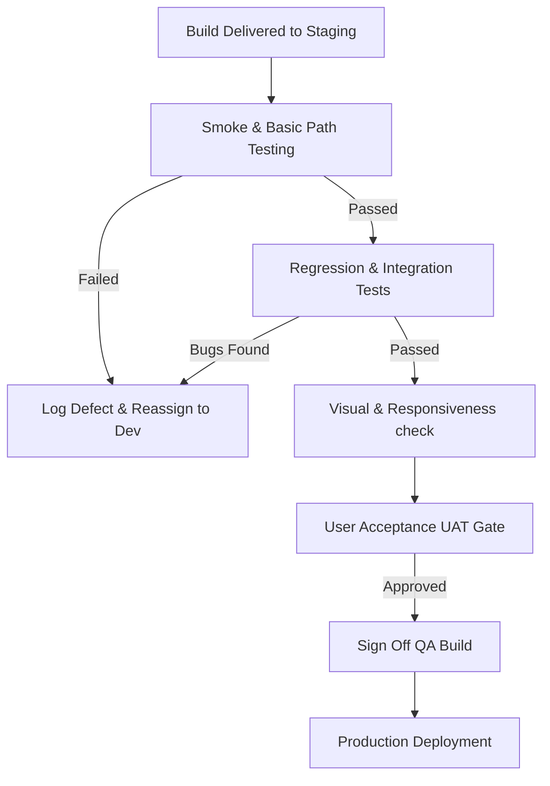

# Standard Operating Procedure (SOP): Quality Assurance & Testing
**Document ID:** SOP-QA-001  
**Scope:** QA Analysts, Automation Engineers, Devs, and release managers.  
**Review Cycle:** Quarterly  
**Last Reviewed:** July 30, 2026

---

## 1. Purpose & Objectives
The purpose of this SOP is to define the testing standards at Kiaan Technology. It outlines test plans, regression test rules, defect logging formats, automated pipelines, visual validation, and final QA build signs-off prior to production deployment.

---

## 2. Key Roles & Responsibilities
- **QA Analyst (QA):** Designs test cases, logs defects, performs manual verification, and manages UAT feedback.
- **Automation Engineer:** Writes unit tests, integrates end-to-end (E2E) testing scripts, and monitors CI/CD pipeline tests.
- **Release Manager:** Reviews QA reports, verifies release notes, and approves production deployments.

---

## 3. Step-by-Step QA Workflow



### Step 3.1: Defect Logging Format
All bug reports logged in JIRA must follow this strict structure to accelerate developer turnaround times:

```text
[Bug Title]: Short descriptive summary of issue (e.g. Booking modal doesn't close on clicking background)

[Environment]: OS, Browser version, Screen Resolution (e.g. iOS 16, Safari Mobile)

[Steps to Reproduce]:
1. Go to page /book-demo
2. Click "Product Demo" selector card
3. Wait for Calendly widget loader
4. Click background area outside the modal frame

[Expected Result]: Modal closes cleanly and releases viewport scroll locks.
[Actual Result]: Modal stays open, locking body scrolls.

[Attachments]: Screenshots/console logs attached.
```

### Step 3.2: Regression & Visual Testing
- **Regression:** Run full regression suite on staging for any release candidate.
- **Visual Checks:** Verify that styling variables match design specs (yellow highlights `#FFD60A`, red accents `#FF3B30`, deep black backgrounds).
- **Core Web Vitals check:** Run Lighthouse audit on staging. No release candidate should increase CLS (>0.1) or LCP (>2.5s).

---

## 4. Tools Used
- **Automation Testing:** Cypress & Playwright
- **Performance Audit:** Google PageSpeed Insights & Lighthouse
- **Defect Tracker:** JIRA Bugs Board

---

## 5. Service Level Agreement (SLA)
- **Smoke Testing:** Completed within **2 hours** of staging deployment.
- **Regression Testing:** Completed within **1 business day** of ticket handoff.
- **Critical Bug Verification:** QA checks fixed builds within **3 hours** of developer submission.

---

## 6. Escalation Matrix
- **Level 1 (Testing Delay):** If a regression backlog is stalled beyond 24 hours, escalate to the **QA Lead**.
- **Level 2 (Release Blocker):** If a critical bug is found on staging 24 hours before scheduled production launch and developers do not resolve it, notify the **Release Manager** (L2 Escalation) to postpone deployment.

---

## 7. Document Revision History

| Version | Date | Author | Description of Changes | Approved By |
| :--- | :--- | :--- | :--- | :--- |
| v1.0.0 | July 30, 2026 | QA Lead | Initial standardized manual & automated QA protocols | QA Director |
| | | | | |
