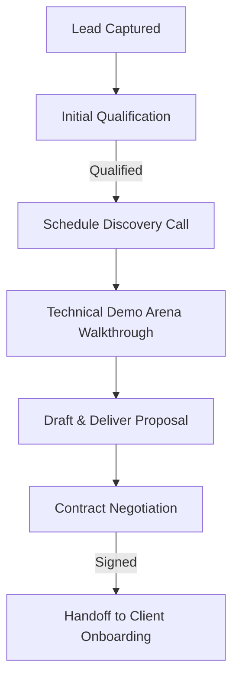

# Standard Operating Procedure (SOP): Sales & Lead Management Workflow
**Document ID:** SOP-SALES-001  
**Scope:** Sales Representative, Account Executives, Sales Managers, and Customer Success.  
**Review Cycle:** Quarterly  
**Last Reviewed:** July 30, 2026

---

## 1. Purpose & Objectives
The purpose of this SOP is to define the structured sales workflow at Kiaan Technology. It outlines lead acquisition, validation, qualification criteria, booking demo calls, sending proposals, closing contracts, and transitioning client profiles to onboarding.

---

## 2. Key Roles & Responsibilities
- **Business Development Representative (BDR):** Sources outbound leads, screens inbound inquiries, qualifying them against BANT parameters.
- **Account Executive (AE):** Conducts discovery sessions, builds software prototypes/demos, creates proposal pricing, and closes contracts.
- **Sales Director:** Reviews and approves customized SLAs, enterprise discount limits, and oversees L2 escalations.

---

## 3. Step-by-Step Sales Workflow

### Step 3.1: Lead Capture & Qualification
Inbound leads arrive via the Contact Form or `/book-demo` scheduling portal.
- **SLA Check:** Lead must be contacted or acknowledged within **24 hours**.
- **BANT Qualification:**
  - **Budget:** Does the client have a realistic budget aligned with custom software rates?
  - **Authority:** Are we speaking with a decision-maker (CTO, VP, SaaS Founder)?
  - **Need:** Is there a clear, technical problem that custom engineering solves?
  - **Timeline:** Is the target delivery schedule realistic (e.g. 2-6 months)?

### Step 3.2: Scheduling & Running Discovery Demo
- **Booking Link:** Direct leads to `kiaantechnology.com/book-demo/`.
- **Preparation:** AEs must check the client's sector (FinTech, HealthTech, SaaS, CRM) and review related Kiaan case studies.
- **Walkthrough:** Show live client outcomes (e.g. PGX Gateway dashboard, TurfPro calendar system) from our portfolio to establish credibility.

### Step 3.3: Proposal Drafting & Delivery
- **Scope Agreement:** Draft a Scope of Work (SOW) based on technical blueprints from engineering.
- **Pricing:** Follow standardized pricing bands (refer to `/pricing` internally).
- **Delivery:** Send the proposal deck and case study pack PDFs to the client via email.

---

## 4. Tools Used
- **CRM System:** Custom Enrollment CRM Portal
- **Booking Integration:** Calendly
- **Proposal Generation:** Figma & Google Slides
- **Contracts/Signatures:** SignFlow SaaS

---

## 5. Service Level Agreement (SLA)
- **Inbound Lead Response:** Within **12 hours** of form submission.
- **Proposal Delivery:** Within **3 business days** post-discovery call.
- **Revision Turnaround:** Within **24 hours** of client feedback.

---

## 6. Escalation Matrix
- **Level 1 (SLA Delay):** If a warm lead remains untouched for >24 hours, notify the **Sales Manager**.
- **Level 2 (Deal Redline Lock):** If enterprise contract negotiations stall or require discount limits (>15% off standard pricing), escalate to the **Sales Director**.

---

## 7. Document Revision History

| Version | Date | Author | Description of Changes | Approved By |
| :--- | :--- | :--- | :--- | :--- |
| v1.0.0 | July 30, 2026 | Sales Manager | Initial standard sales pipeline framework | VP of Business Development |
| | | | | |
